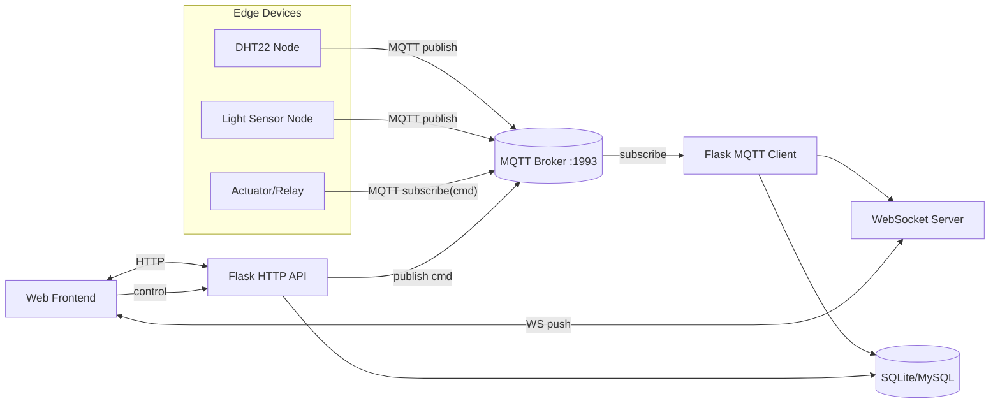

# Smart Home – Tài liệu hệ thống

> Hệ thống giám sát & điều khiển thiết bị IoT thời gian thực qua MQTT, Flask (HTTP + WebSocket) và cơ sở dữ liệu SQLite/MySQL. Tài liệu này mô tả giao diện, kiến trúc, luồng dữ liệu, schema, API và hướng triển khai.

## Mục lục
1. [Tổng quan & Mục tiêu](#tổng-quan--mục-tiêu)  
2. [Giao diện người dùng](#i-giao-diện-người-dùng)  
3. [Kiến trúc & Luồng giao tiếp](#ii-sơ-đồ-giao-tiếp)  
4. [Cấu hình & Thông số hệ thống](#cấu-hình--thông-số-hệ-thống)  
5. [Thiết kế chủ đề (topic) & payload MQTT](#thiết-kế-chủ-đề-topic--payload-mqtt)  
6. [Thiết kế Database & Chỉ mục](#thiết-kế-database)  
7. [API (HTTP & WebSocket)](#iii-api-document)  
8. [Bảo mật & An toàn hệ thống](#bảo-mật--an-toàn-hệ-thống)  
9. [Triển khai & Vận hành](#triển-khai--vận-hành)  
10. [Kiểm thử & Giám sát](#kiểm-thử--giám-sát)  
11. [Hướng mở rộng](#hướng-mở-rộng)  
12. [Phụ lục](#phụ-lục)

---

## Tổng quan & Mục tiêu
- **Bài toán:** Thu thập dữ liệu cảm biến (DHT22…), hiển thị thời gian thực, lưu lịch sử; đồng thời cho phép điều khiển thiết bị và lưu lại “action history”.
- **Mục tiêu:**  
  - UI realtime mượt, phản hồi nhanh.  
  - Backend đơn giản, dễ mở rộng, chuẩn hoá API.  
  - Lưu trữ an toàn, truy vấn nhanh, có chỉ mục.  
  - Dễ triển khai on-prem hoặc container.

---

## I. Giao diện người dùng

### 1) Dashboard tổng quan


- Hiển thị nhanh **nhiệt độ/độ ẩm/ánh sáng** hiện tại.  
- Card trạng thái thiết bị (ON/OFF), nút điều khiển tức thời.  
- Mini-chart đường (sparkline) 5–10 phút gần nhất để cảm nhận xu hướng.

### 2) Lịch sử điều khiển (Action History)


- Bảng **DeviceHistory** với lọc theo thiết bị, lệnh, thời gian.  
- Có phân trang, sắp xếp theo timestamp; nút **Export CSV**.

### 3) Dữ liệu cảm biến thời gian thực (Data Sensor)


- Biểu đồ thời gian thực (qua WebSocket) cập nhật mỗi lần broker đẩy dữ liệu.  
- Bộ lọc khoảng thời gian (Last 15m/1h/24h/Tuỳ chọn), **downsample** khi vẽ để mượt.

### 4) Trang hồ sơ (Profile)


- Quản lý thông tin người dùng, đổi mật khẩu, token API cá nhân.  
- Tuỳ chọn timezone/định dạng ngày giờ, theme UI.

---

## II. Sơ đồ Giao tiếp

### Mô tả luồng
1. **Thiết bị → MQTT Broker → Flask MQTT Client**  
   - Thiết bị publish dữ liệu (temp/humidity/light) vào các topic định trước.  
   - Flask MQTT Client subscribe và nhận gói tin.

2. **Flask MQTT Client → Backend/WebSocket**  
   - Flask xử lý, lưu DB và phát sự kiện realtime qua WebSocket cho UI.  
   - Các API HTTP phục vụ truy vấn lịch sử/lọc/tìm kiếm.

3. **Backend → Flask → MQTT Broker (điều khiển)**  
   - Khi người dùng thao tác UI, Flask publish lệnh điều khiển đến topic **cmd** của thiết bị.

### Sơ đồ (Mermaid)


---

## Cấu hình & Thông số hệ thống

> **Lưu ý bảo mật:** Thông tin dưới đây dùng cho môi trường demo. Khi triển khai thực tế, đặt biến môi trường và bật TLS cho MQTT/HTTP.

- **MQTT Broker**  
  - Kết nối: `mqtt://localhost:1993`  
  - **Username:** `HaiND`  
  - **Password:** `B21DCAT004`  
- **Flask Server (HTTP + WebSocket)**  
  - Cổng HTTP: `4444`  
  - Route chính:  
    - `/api/v1/sensor/*`  
    - `/api/v1/device/*`
  - WebSocket cùng host (Socket.IO/eventlet).

### Gợi ý `.env`
```bash
MQTT_HOST=localhost
MQTT_PORT=1993
MQTT_USERNAME=HaiND
MQTT_PASSWORD=B21DCAT004

FLASK_HOST=0.0.0.0
FLASK_PORT=4444
SECRET_KEY=change-me
DATABASE_URL=sqlite:///./smarthome.db
# MySQL ví dụ: DATABASE_URL=mysql+pymysql://user:pass@db:3306/smarthome
```

---

## Thiết kế chủ đề (topic) & payload MQTT

### Đề xuất đặt tên topic
- Cảm biến:
  - `home/sensor/dht22/{nodeId}` → dữ liệu nhiệt độ/độ ẩm
  - `home/sensor/light/{nodeId}` → dữ liệu ánh sáng
- Thiết bị (trạng thái & lệnh):
  - `home/device/{deviceId}/state` → thiết bị publish trạng thái hiện tại
  - `home/device/{deviceId}/cmd` → backend publish lệnh điều khiển

### Payload JSON mẫu

**Sensor (publish bởi thiết bị)**
```json
{
  "device_id": "dht22-01",
  "temp": 27.6,
  "humidity": 63,
  "light": 420,
  "ts": "2025-09-23T03:00:11Z"
}
```

**Command (publish bởi backend)**
```json
{
  "command": "TURN_ON",
  "device_name": "FAN_1",
  "by": "admin",
  "ts": "2025-09-23T03:00:30Z"
}
```

**State (publish bởi thiết bị)**
```json
{
  "device_name": "FAN_1",
  "status": "ON",
  "ts": "2025-09-23T03:00:31Z"
}
```

---

## Thiết Kế Database

> Bạn ghi “SQLite” nhưng schema ban đầu dùng cú pháp MySQL (`AUTO_INCREMENT`). Dưới đây là hai phiên bản tương thích:

### 1) SQLite (khuyến nghị cho demo)
```sql
CREATE TABLE IF NOT EXISTS DataRealTime (
  id INTEGER PRIMARY KEY AUTOINCREMENT,
  temp REAL NOT NULL,
  humidity INTEGER NOT NULL,
  light INTEGER NOT NULL,
  timestamp DATETIME DEFAULT CURRENT_TIMESTAMP
);

CREATE INDEX IF NOT EXISTS idx_DataRealTime_ts ON DataRealTime(timestamp);

CREATE TABLE IF NOT EXISTS DeviceHistory (
  id INTEGER PRIMARY KEY AUTOINCREMENT,
  device_name TEXT NOT NULL,
  command TEXT NOT NULL,
  status TEXT NOT NULL,
  timestamp DATETIME DEFAULT CURRENT_TIMESTAMP
);

CREATE INDEX IF NOT EXISTS idx_DeviceHistory_ts ON DeviceHistory(timestamp);
CREATE INDEX IF NOT EXISTS idx_DeviceHistory_device ON DeviceHistory(device_name);
```

### 2) MySQL/MariaDB (nếu chuyển sang RDBMS)
```sql
CREATE TABLE `DataRealTime` (
  `id` INT NOT NULL AUTO_INCREMENT,
  `temp` DOUBLE NOT NULL,
  `humidity` INT NOT NULL,
  `light` INT NOT NULL,
  `timestamp` DATETIME DEFAULT CURRENT_TIMESTAMP,
  PRIMARY KEY (`id`),
  INDEX `idx_ts` (`timestamp`)
) ENGINE=InnoDB DEFAULT CHARSET=utf8mb4;

CREATE TABLE `DeviceHistory` (
  `id` INT NOT NULL AUTO_INCREMENT,
  `device_name` VARCHAR(50) NOT NULL,
  `command` VARCHAR(50) NOT NULL,
  `status` VARCHAR(50) NOT NULL,
  `timestamp` DATETIME DEFAULT CURRENT_TIMESTAMP,
  PRIMARY KEY (`id`),
  INDEX `idx_ts` (`timestamp`),
  INDEX `idx_device` (`device_name`)
) ENGINE=InnoDB DEFAULT CHARSET=utf8mb4;
```

### Gợi ý tối ưu
- **Chỉ mục** theo `timestamp` để truy vấn khoảng thời gian nhanh hơn.  
- **Ràng buộc dữ liệu** (CHECK, enum) cho `status`/`command` khi dùng MySQL.  
- **Retention**: Cron xoá dữ liệu thô >90 ngày, lưu aggregate theo giờ/ngày cho dashboard.

---

## III. API document.

> Tài liệu chi tiết trên Postman:  
> **[Tài liệu API](https://documenter.getpostman.com/view/39489332/2sAY4ye1DQ)**

Dưới đây là tóm tắt các nhóm API và ví dụ mẫu để bạn đưa thẳng vào README.

### Nhóm Sensor
- `GET /api/v1/sensor/realtime/latest`  
  **200**:
  ```json
  { "temp": 27.6, "humidity": 63, "light": 420, "timestamp": "2025-09-23T03:00:11Z" }
  ```

- `GET /api/v1/sensor/history?from=2025-09-23T00:00:00Z&to=2025-09-23T03:00:00Z&limit=1000`  
  **200**:
  ```json
  {
    "items": [
      {"temp": 27.4, "humidity": 62, "light": 410, "timestamp": "2025-09-23T02:59:11Z"},
      {"temp": 27.6, "humidity": 63, "light": 420, "timestamp": "2025-09-23T03:00:11Z"}
    ],
    "count": 2
  }
  ```

- `GET /api/v1/sensor/stats?bucket=minute&range=1h`  
  Trả về trung bình/cao nhất/thấp nhất theo bucket.

### Nhóm Device
- `GET /api/v1/device/list`  
  **200**:
  ```json
  {
    "devices": [
      {"device_name":"FAN_1","status":"ON","last_seen":"2025-09-23T03:00:31Z"},
      {"device_name":"LAMP_1","status":"OFF","last_seen":"2025-09-23T02:59:02Z"}
    ]
  }
  ```

- `POST /api/v1/device/{device_name}/command`  
  **Body**:
  ```json
  { "command":"TURN_ON" }
  ```
  **200**:
  ```json
  { "ok": true, "published": true, "device_name":"FAN_1", "command":"TURN_ON" }
  ```

- `GET /api/v1/device/history?device=FAN_1&from=...&to=...`  
  Trả về bản ghi từ **DeviceHistory**.

### WebSocket (Socket.IO)
- **Sự kiện server → client**
  - `sensor:update`  
    ```json
    { "temp":27.6, "humidity":63, "light":420, "timestamp":"2025-09-23T03:00:11Z" }
    ```
  - `device:history:new`  
    ```json
    { "device_name":"FAN_1","command":"TURN_ON","status":"OK","timestamp":"..." }
    ```

- **Client mẫu**
  ```html
  <script src="/socket.io/socket.io.js"></script>
  <script>
    const socket = io(window.location.origin, { transports: ['websocket'] });
    socket.on('connect', () => console.log('WS connected'));
    socket.on('sensor:update', (data) => updateCharts(data));
    socket.on('device:history:new', (row) => prependHistoryRow(row));
  </script>
  ```

### cURL kiểm thử nhanh
```bash
curl http://localhost:4444/api/v1/sensor/realtime/latest
curl "http://localhost:4444/api/v1/sensor/history?from=2025-09-23T00:00:00Z&to=2025-09-23T03:00:00Z"
curl -X POST http://localhost:4444/api/v1/device/FAN_1/command -H 'Content-Type: application/json' -d '{"command":"TURN_OFF"}'
```

---

## Bảo mật & An toàn hệ thống
- **Bảo vệ MQTT:**  
  - Bật **TLS** cho broker (cổng 8883), tạo **user/pass** riêng theo từng thiết bị.  
  - Phân quyền topic (ACL) để thiết bị chỉ publish/subscribe đúng phần việc.
- **HTTP API:**  
  - Bảo vệ bằng **JWT/OAuth2**; rate-limit theo IP/tài khoản; bật CORS có kiểm soát.  
  - Validate dữ liệu đầu vào (schema JSON), chống injection.  
- **Quản lý secrets:**  
  - Không hardcode; dùng **env**/**vault**.
- **Audit & nhật ký:**  
  - Ghi log mọi lệnh điều khiển (ai, khi nào, kết quả).  
  - Log theo định dạng JSON, có trace-id để correlate với MQTT message.
- **An toàn dữ liệu:**  
  - Sao lưu DB định kỳ; kiểm soát truy cập file DB (SQLite).  
  - Chính sách lưu giữ (retention) & xoá dữ liệu khi hết hạn.

---

## Triển khai & Vận hành

### Docker Compose (tham khảo)
```yaml
services:
  broker:
    image: eclipse-mosquitto:2
    ports: ["1993:1883"]
    volumes:
      - ./mosquitto.conf:/mosquitto/config/mosquitto.conf:ro

  backend:
    build: ./backend
    env_file: .env
    ports: ["4444:4444"]
    depends_on: [broker]
```

**Gunicorn + eventlet** (ví dụ lệnh chạy):
```bash
gunicorn -k eventlet -w 1 app:app --bind 0.0.0.0:4444
```

**Kiểm thử MQTT cục bộ**
```bash
# Publish cảm biến giả lập
mosquitto_pub -h localhost -p 1993 -u HaiND -P B21DCAT004 \
  -t home/sensor/dht22/dht22-01 \
  -m '{"device_id":"dht22-01","temp":27.6,"humidity":63,"light":420,"ts":"2025-09-23T03:00:11Z"}'

# Subscribe theo dõi
mosquitto_sub -h localhost -p 1993 -u HaiND -P B21DCAT004 -t 'home/#' -v
```

---

## Kiểm thử & Giám sát
- **Postman Collection:** đã công bố tại tài liệu của bạn để chạy test API.  
- **Test tự động:** pytest + requests cho API; unit test parser MQTT payload.  
- **Giám sát:**  
  - Health check `/healthz`, metric Prometheus `/metrics` (nếu cần).  
  - Cảnh báo khi thiết bị “mất kết nối” (không thấy `last_seen` > X phút).

---

## Hướng mở rộng
- **Role-based Access Control (RBAC)**: phân quyền theo nhóm/người dùng.  
- **Nhiều loại cảm biến**: CO₂, PM2.5, cửa/động thái PIR…  
- **Cảnh báo thông minh**: rule engine (nhiệt độ > ngưỡng → gửi Telegram/Email).  
- **Edge buffering**: khi mất mạng, node lưu cục bộ và đồng bộ sau.  
- **Chuyển DB**: SQLite → MySQL/PostgreSQL khi tải tăng.  
- **TLS & mTLS cho MQTT**: dùng certificate theo thiết bị.

---

## Phụ lục

### A) Mô hình dữ liệu (khái niệm)
- **DataRealTime**: (id, temp, humidity, light, timestamp)  
- **DeviceHistory**: (id, device_name, command, status, timestamp)

### B) Truy vấn mẫu
```sql
-- Trung bình 1 giờ gần nhất
SELECT AVG(temp) AS avg_temp, AVG(humidity) AS avg_hum, AVG(light) AS avg_light
FROM DataRealTime
WHERE timestamp >= datetime('now', '-1 hour');

-- Lịch sử điều khiển của FAN_1 hôm nay
SELECT * FROM DeviceHistory
WHERE device_name='FAN_1'
  AND date(timestamp)=date('now')
ORDER BY timestamp DESC;
```

### C) Checklist triển khai nhanh
- [ ] Cấu hình broker + ACL, thử pub/sub.  
- [ ] Chạy Flask (HTTP + WS), test `/healthz`.  
- [ ] Kết nối MQTT (client), xác nhận dữ liệu vào DB.  
- [ ] Kiểm tra UI realtime, lọc & export.  
- [ ] Thiết lập backup DB, logrotate, retention.

---

### Link tài liệu API
- **Postman**: https://documenter.getpostman.com/view/39489332/2sAY4ye1DQ
